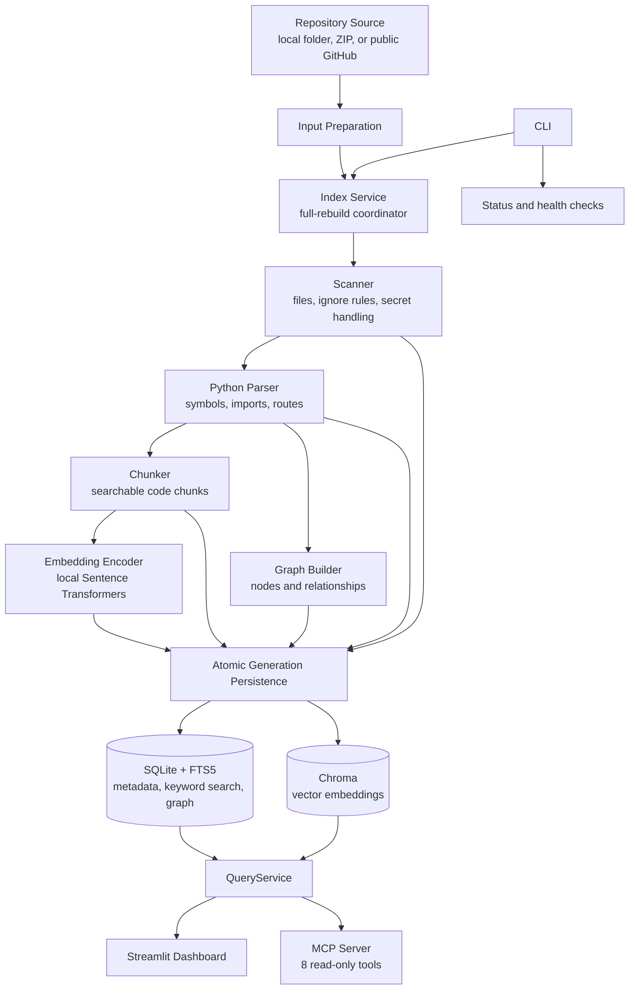

<p align="center">
  
</p>

<p align="center">
  <em>Local repository intelligence for developers and AI coding agents.</em>
</p>

<p align="center">
  
  
  
  
</p>

---

DeepOrra indexes a local Python repository and makes its structure, symbols, routes, and code relationships available through search, a dashboard, and read-only MCP tools — so AI coding agents can check what already exists before writing new code.

<!-- Product screenshot or demo video will be added here. -->

---

## Contents

- [Quick Start](#quick-start)
- [MCP Server](#mcp-server)
- [Architecture](#architecture)
- [Privacy](#privacy)
- [Development](#development)
- [Roadmap](#roadmap)

---

## Why DeepOrra

Coding agents working on unfamiliar repositories often write code that already exists. They lack local, structured knowledge of the codebase. DeepOrra fills that gap: it scans, parses, chunks, embeds, and graphs a repository on your machine, then exposes that intelligence through query tools that agents can use at planning time.

DeepOrra does not upload indexed source code to hosted services. After the dependencies and embedding model are installed, local indexing and querying can run offline. First-time model installation and GitHub repository input require network access.

## Key Features

- **Local-first indexing** — repository index data is stored in `.deeporra/` inside your repository
- **Python AST analysis** — extracts functions, classes, methods, imports, and routes
- **Semantic embeddings** — local Sentence Transformers (all-MiniLM-L6-v2, 384 dimensions)
- **Three search modes** — lexical (FTS5), semantic (Chroma), and hybrid ranking
- **Code graph** — relationships between files, symbols, imports, routes, and tests
- **Read-only MCP server** — 8 planning tools for AI coding agents
- **Streamlit dashboard** — human inspection of indexed repositories
- **Secret handling** — sensitive files are excluded and detected secrets are redacted according to DeepOrra's scanner rules

## Quick Start

```bash
# Install from source
pip install -e .

# Check environment health
python -m deeporra doctor /path/to/repo

# Index a repository
python -m deeporra index /path/to/repo

# View index status
python -m deeporra status /path/to/repo

# Start the MCP stdio server
python -m deeporra.mcp_server

# Start the Streamlit dashboard
python -m deeporra.dashboard
```

If the package console script is on your PATH, you can also use `deeporra` directly:

```bash
deeporra doctor /path/to/repo
deeporra index /path/to/repo
deeporra status /path/to/repo
deeporra mcp --repo /path/to/repo
deeporra dashboard --port 8501
```

Before indexing, install the embedding model:

```bash
python -c "from sentence_transformers import SentenceTransformer; SentenceTransformer('sentence-transformers/all-MiniLM-L6-v2')"
```

`deeporra doctor` never downloads the model. It only verifies that the model is already installed.

## Commands

### Indexing

```bash
python -m deeporra index [repo_path]
```

Performs a full scan → parse → chunk → embed → graph → persist pipeline. Creates a new generation in `.deeporra/` and promotes it to active on success. The default `repo_path` is the current directory.

### Status

```bash
python -m deeporra status [repo_path]
```

Shows the active index generation state and canonical counts (scanned files, parsed files, symbols, chunks, embeddings, graph nodes/edges, warnings, errors).

### Doctor

```bash
python -m deeporra doctor [repo_path]
```

Runs offline health checks: Python version, required imports, SQLite FTS5 availability, local embedding model presence, directory writability, and config file parsing.

## MCP Server

The read-only MCP stdio server provides planning tools for AI coding agents. Launch it using either the CLI command or the module entry point:

```bash
deeporra mcp --repo /path/to/repo
# or
python -m deeporra.mcp_server
```

Configure your coding agent to launch this command as an MCP stdio subprocess. All tools require a `repository_root` that has been indexed by DeepOrra.

### MCP Tools

| Tool | Purpose |
|------|---------|
| `repository_summary` | Return summary statistics for an indexed repository |
| `search_code` | Search code chunks by text, semantic, or hybrid mode |
| `hybrid_search` | Search code using combined text + semantic ranking |
| `find_symbols` | Find functions, classes, and methods matching a name |
| `find_routes` | Find HTTP route definitions by method, path, or handler |
| `get_related_code` | Find related code nodes through graph edges (one hop) |
| `analyze_change_impact` | First-order impact analysis for a symbol |
| `find_existing_implementation` | Search for existing code matching a description |

MCP tools do not modify or delete repository source files. Once the dependencies and embedding model are available locally, MCP tool calls do not require network access.

## Streamlit Dashboard

Launch the dashboard using either the CLI command or the module entry point:

```bash
deeporra dashboard --port 8501
# or
python -m deeporra.dashboard
```

Opens a local Streamlit app on `localhost:8501` (default). The dashboard provides human inspection of an indexed repository: overview stats, code search, symbol lookup, route browsing, related-code exploration, and change impact analysis.

## Architecture

The indexing pipeline consists of six phases: scan (discover files, apply ignore rules, detect secrets), parse (extract symbols, imports, routes from Python AST), chunk (build searchable code fragments), embed (encode with local Sentence Transformers), build graph (capture file–symbol, import, and route relationships), and persist (write atomically to SQLite, FTS5, Chroma, and graph stores). QueryService unifies reads across all stores for the CLI, MCP server, and dashboard.



The CLI manages indexing, status, and environment checks. The dashboard and MCP server use QueryService to read the active SQLite/FTS5, graph, and Chroma index.

## Privacy

DeepOrra runs entirely on your laptop:

- **No uploads** — repository code never leaves your machine
- **No hosted embeddings** — Sentence Transformers runs locally on CPU
- **Local communication** — MCP communicates through stdio. The dashboard defaults to a local Streamlit address and is not a hosted DeepOrra service.
- **Secret handling** — sensitive files are excluded and detected secrets are redacted according to DeepOrra's scanner rules

## Requirements

- Python 3.10+ with SQLite FTS5 support. Run `python -m deeporra doctor` to verify your environment.
- Required: typer, rich, chromadb, sentence-transformers, pydantic, python-dotenv, typing-extensions, mcp, streamlit
- Optional: tree-sitter + tree-sitter-python (multi-language parsing, deferred to a later release)

## Current Limitations

- **Python-only parsing** — AST support limited to Python (first release). Multi-language parsing is deferred.
- **First-order impact only** — `analyze_change_impact` shows direct relationships, not transitive analysis.
- **No incremental indexing** — each `index` run performs a full rebuild.
- **One-hop graph** — `get_related_code` supports depth=1 only.
- **No automatic source editing** — MCP tools are read-only and planning-only.
- **No private repository authentication** — deferred.
- **No hosted SaaS** — local-first only.
- **No CI/CD integration** — deferred.
- **Windows-focused** — tested on Windows. macOS and Linux not yet validated.

## Development

```bash
# Install with dev dependencies
pip install -e ".[dev]"

# Run tests
python -m pytest tests/ -v

# Run tests with coverage
python -m pytest tests/ --cov=deeporra --cov-report=term-missing
```

The authoritative documentation for contributors is `AGENTS.md` and `docs/01_CONTEXT.md` through `docs/09_AGENT_TASKS.md`.

## Roadmap

- Multi-language parsing (TypeScript, Go)
- Incremental indexing
- Private repository support
- Extended graph traversal (multi-hop)
- Agent setup workflow
- CI/CD integration
- Broader platform support (macOS, Linux)

## Contributing

Contributions are welcome. See the development section above and the documentation in `docs/` for implementation details. Please open an issue first for significant changes.

## Security

Please do not report security vulnerabilities through public GitHub issues. See [SECURITY.md](SECURITY.md) for private reporting instructions.

## Changelog

See [CHANGELOG.md](CHANGELOG.md) for the full release history.

## License

DeepOrra is licensed under the [MIT License](https://github.com/ashishkumar62649/deeporra/blob/main/LICENSE).

---

## Project Status

DeepOrra is in early development (v0.1.0). The indexing pipeline, CLI commands, MCP server, and dashboard are functional but the API and data format may change in breaking ways before 1.0.0. Test thoroughly before relying on persisted indexes across versions.
